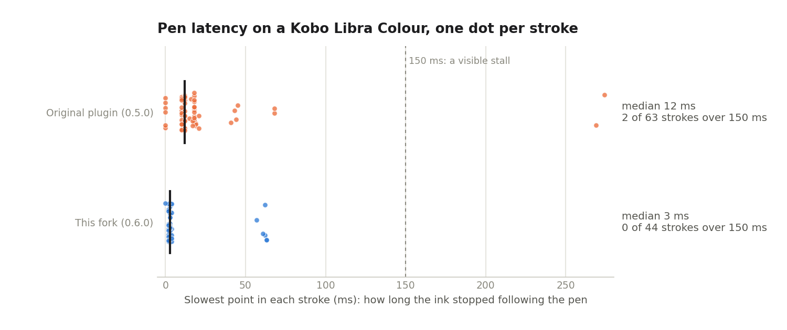
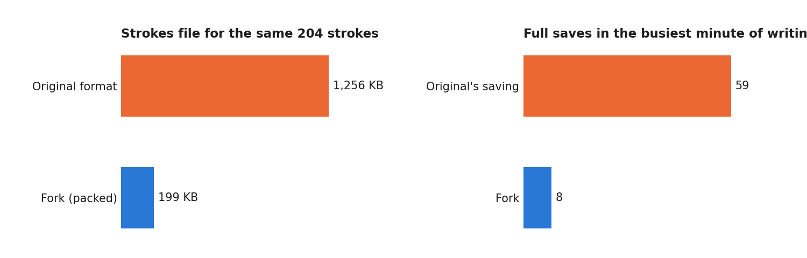

# Pencil for KOReader (maintained fork)

Write in the margins of your books with a stylus, in [KOReader](https://koreader.rocks/) on a Kobo.

This is a maintained fork of [mysticknits/pencil.koplugin](https://github.com/mysticknits/pencil.koplugin), which made all of this possible and hasn't been updated since May 2026. It's a drop-in replacement: same plugin folder, same menus, and your existing ink comes with you. On top of the original it makes the pen responsive on colour Kobos, saves faster, keeps your notes anchored to the text, and exports each page you write on in a documented format other apps can read.

## What's new in this fork

- **A responsive pen on the Libra Colour.** Black ink is drawn with the display's fast waveform while you write, then sharpened in one pass when you pause. The ink no longer stalls mid-word ([details](#performance)).
- **Smaller, faster saves.** Strokes are saved once after you stop writing, not after nearly every stroke, in a format about six times smaller. These two fixes come from the original author's unmerged [pull request #77](https://github.com/mysticknits/pencil.koplugin/pull/77), carried over with thanks.
- **Ink follows the text.** Each stroke records the word it was written beside. Change the font, its size or the margins, and your notes are drawn beside their words on whatever page those are on now, while underlines and circles are drawn again under and around the words they mark, however the passage wraps. Change back and the ink is exactly as you wrote it.
- **The pen menu.** Tool (pen, highlight, eraser), colour and width in one place, opened by a gesture of your choice. With the Highlight tool, dragging across text makes a KOReader highlight.
- **Markup export.** Each visit to a page you write on is saved as a folder with your ink, a clean picture of the page, and every word on it with its position, so apps such as [Kollate](https://github.com/andrew-lawlor/kollate) can turn your handwriting into searchable notes, with what you underlined or circled as the book's exact words. See [the format](docs/markup-export.md).
- **Nothing slow near the pen.** Page pictures are taken when you arrive on a page, and encoding and writing wait until you've been idle for a few seconds.

## Performance

Measured on a Kobo Libra Colour with KOReader 2026.07.1, writing normally for a minute or two, with the fork's built-in profiler (`lib/profile.lua`).

| | Original (0.5.0) | This fork (0.6.0) |
|---|---|---|
| Slowest point per stroke, median | 12 ms | **3 ms** |
| Slowest point per stroke, 90th percentile | 43 ms | 61 ms |
| Strokes where the ink stalled for over 150 ms | 2 of 63 | **0 of 44** |
| Strokes file for the same 204 strokes | 1,256 KB | **199 KB** |
| Full saves in the busiest minute of writing | 59 | **8** |

**Why the pen stalled.** On MediaTek-based Kobos such as the Libra Colour, KOReader waits for the display controller to accept every partial refresh drawn with the normal UI waveform, and the controller holds an update back while an earlier, overlapping one is still running, about a quarter of a second. The pen refreshes its ink every 16 ms over overlapping areas, so now and then a refresh blocked for that long and the ink stopped following the pen. Refreshes with the fast waveform aren't waited on, and black ink on white is what that waveform is for. The trade-off: while you write, ink looks slightly jagged, and it sharpens when you pause. Coloured pens, grey, the highlighter and night mode keep the normal waveform.

**The 90th percentile is a little higher** in the fork because the first point of a stroke after a pause can wait about 60 ms while the display wakes up.

## Requirements

- A Kobo with a stylus. Tested on the **Kobo Libra Colour** and the **Kobo Elipsa 2E** with the Kobo Stylus 2, with EPUB books.
- **KOReader 2026.07 or newer.** Older versions aren't supported. KOReader's own files stay as they are: unlike the original plugin, the fork doesn't need a replacement `input.lua`.

## Installation

1. Download `pencil.koplugin.zip` from the [latest release](https://github.com/andrew-lawlor/pencil.koplugin/releases/latest) and unzip it.
2. Connect your Kobo by USB and copy the `pencil.koplugin` folder into `.adds/koreader/plugins/`, replacing the original plugin's folder if you have it.
3. Eject, and restart KOReader.

### Coming from the original plugin

If you replaced KOReader's `input.lua` for the original plugin, you can leave it: the fork works with either. A KOReader update puts the stock file back.

Your ink is upgraded the first time the fork saves each book's strokes: nothing is lost, and the strokes file becomes much smaller. The original plugin can't read the new format, so if you might go back, copy your books' `.sdr` folders somewhere safe first.

## Features

- **Pen tip**: Draw annotations on your ebooks
- **Eraser end**: Flip your stylus over to erase strokes instantly
- **Pen menu**: Choose the tool (pen, highlight or eraser), the pen's colour and its width. Open it from a gesture you choose (below), or from the Pencil menu
- **Highlight text**: With the Highlight tool, drag the pen across text to make a KOReader highlight, as with a long press and Highlight
- **Highlighter**: Hold the stylus side button and draw for a highlighter stroke; tap the side button to toggle pencil/eraser
- **Swap Eraser/Highlighter**: Reassign which side button acts as eraser vs. highlighter from the menu
- **Undo**: Undo your last stroke or eraser action
- **Clear strokes**: Clear annotations for the current page or the entire document
- **Annotation grouping**: Strokes are automatically grouped into logical annotations based on timing and proximity
- **Enable/disable toggle**: Turn the plugin on or off via the menu or a mapped gesture
- **Per-document storage**: Annotations are saved with each book
- **Input debug mode**: Log raw stylus events to help diagnose detection issues

## Configuring the Pencil Plugin

1. Enable the plugin from the Pencil menu (Top menu > More tools > Pencil > Enabled)
2. If your stylus's side button mapping is reversed, toggle **Swap Eraser and Highlighter** in the Pencil menu
3. Map **Pencil: pen menu** to a gesture (Top menu > Settings > Taps and gestures > Gesture manager), such as a two-finger tap or a corner tap, to open the pen menu from the page. The menu appears in the middle of the screen; tap a tool, colour or width, or tap outside it to close it
4. Optionally map other actions to gestures:
   - **Pencil: toggle on/off** — enable or disable the plugin
   - **Pencil: toggle pencil/eraser** — switch between tools
   - **Pencil: select pencil** — switch to pencil
   - **Pencil: select highlight** — switch to highlighting text
   - **Pencil: select eraser** — switch to eraser
   - **Pencil: undo** — undo last stroke or eraser action

## Questions or Issues with the Plugin

If you have any questions or a feature request, please submit an issue in this repo.
If you're experiencing issues with the plugin, please enable input debug mode in the Pencil menu, reproduce the issue, and include the debug log file in your issue report.

## Experimental Features

Some features are still in development and are hidden behind an experimental toggle. You can find them under **Pencil menu > Experimental**.

(The original's colour and width pickers, opened by holding the pen still, are now the pen menu. Holding the pen still can still open it: **Pencil menu > Open the pen menu by holding the pen still**, off by default because a pause while writing opens it too.)

### Bookmark Sync

When enabled, the plugin automatically groups your pencil strokes into logical annotations (based on timing and proximity) and creates KOReader bookmarks for each one. This means annotated pages show up in the **Bookmarks menu**, so you can quickly navigate back to pages you've written on.

**To enable:** Pencil menu > Experimental > Bookmark sync

**What happens when you turn it on:**
- Existing pencil annotations are grouped and bookmarks are created immediately
- New strokes are grouped and bookmarked as you draw
- Bookmarks appear in KOReader's Bookmarks menu as "Pencil annotation on page X"
- Erasing or undoing strokes updates the bookmarks automatically

**What happens when you turn it off:**
- All pencil bookmarks are removed from the Bookmarks menu
- Your pencil strokes and drawings are not affected — only the bookmarks are removed
- Annotation groups are still tracked internally, so you won't lose any grouping data if you turn it back on

## Markup export

Each page you write on gets a folder in the book's settings folder, `<book>.sdr/pencil/markups/<id>/`:

| File | What it holds |
|---|---|
| `markup.json` | When and where: times, the first and last positions on the page, chapter, screen and layout. Written last. |
| `ink.json` | Your strokes, in page pixels and in the order you wrote them, each with the word it's anchored to |
| `page.png` | The page as it looked, in grey, without your ink |
| `words.json` | Every word on the page with its box and position in the book |

The full format is in [docs/markup-export.md](docs/markup-export.md).

## Development

Tests run with [busted](https://lunarmodules.github.io/busted/) on Lua 5.1: `busted spec/`. New logic lives in small modules under `pencil.koplugin/lib/` so it can be tested without KOReader. To measure on a device, set `PROFILE = true` at the end of `main.lua`: timings go to KOReader's `crash.log`.

## Acknowledgements

The original plugin is by [mysticknits](https://github.com/mysticknits). This fork carries over their unmerged pull request #77 (save and refresh fixes, packed strokes).

Eraser end detection based on techniques from [eraser.koplugin](https://github.com/SimonLiu423/eraser.koplugin) by SimonLiu.

## Licence

AGPL-3.0, as the original. See [LICENSE](LICENSE).
